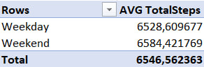
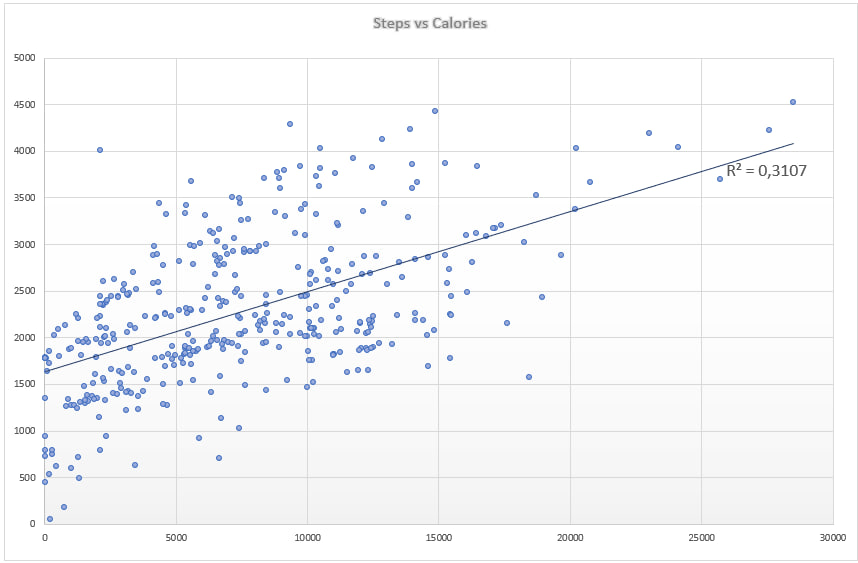

# Bellabeat Case Study

## Project Overview
This case study analyzes user activity data from Bellabeat/Fitbit fitness trackers to identify behavioral patterns and relationships between physical activity and calorie expenditure.

The project combines Excel-based exploratory analysis with SQL analysis in Google BigQuery.
## Business Task
The goal of this analysis was to explore user activity behavior and identify patterns related to physical activity, calorie expenditure, and differences between weekday and weekend activity levels.
## Data Source
The dataset used in this project is the Fitbit Fitness Tracker Data available on Kaggle.

It contains daily activity records collected from Fitbit users, including:
- total steps,
- calories burned,
- activity intensity,
- and date-based activity information.
## Tools Used
- Microsoft Excel – exploratory data analysis, pivot tables, scatter plots, and trendline analysis
- Google BigQuery – SQL-based analysis and aggregation
- SQL – data querying, grouping, and correlation analysis
## Data Cleaning
Minor data cleaning was performed specifically for exploratory analysis and visualization purposes.

This included:
- converting date values into a proper date format,
- filtering incomplete or irrelevant records,
- creating a weekday/weekend category for activity comparison.
## Hypotheses
### Hypothesis 1
Users are less physically active on weekdays compared to weekends.

### Hypothesis 2
Higher daily step count is associated with higher calorie expenditure.

### Hypothesis 3
Better sleep quality may lead to higher calorie expenditure.

The third hypothesis could not be reliably tested due to insufficient merged sleep/activity data in the available dataset.
## SQL Analysis
SQL analysis was performed in Google BigQuery to validate activity-related hypotheses and calculate user behavior metrics.

The analysis included:
- weekday vs weekend activity aggregation,
- average daily step calculations,
- and correlation analysis between total steps and calories burned.

All SQL queries used in this project are available in the `sql/analysis.sql` file.
## Visualizations
### Weekday vs Weekend Activity Comparison

Pivot table analysis was used to compare average activity levels between weekdays and weekends.

### Steps vs Calories Burned

A scatter plot with a trendline was created to analyze the relationship between daily step count and calories burned.

## Key Findings
- Weekday and weekend activity levels were very similar, with only minor differences in average daily steps.

- A moderate positive relationship was observed between total daily steps and calories burned.

- The scatter plot trendline produced an R² value of approximately 0.31, indicating that daily step count partially explains calorie expenditure.

- Correlation analysis in SQL confirmed a moderate positive relationship between physical activity and calories burned.
## Limitations
- The dataset covered only a limited time period, making seasonal analysis unreliable.

- Some hypotheses could not be fully validated due to insufficient merged sleep and activity data.

- The analysis focused primarily on exploratory insights and simple statistical relationships rather than advanced predictive modeling.
## Recommendations
- Bellabeat could encourage users to increase daily step count through personalized activity goals and motivational notifications.

- Since weekday and weekend activity levels were relatively similar, engagement strategies could focus on overall consistency rather than specific days of the week.

- Additional sleep-related data could improve future behavioral analysis and support more advanced health insights.